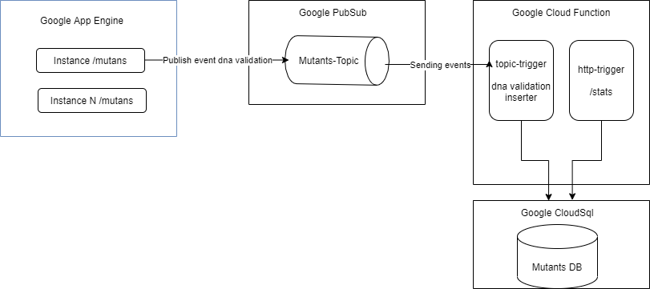

# ml-code-challenge

[](https://sonarcloud.io/dashboard?id=fcataniae_ml-code-challenge)
[](https://sonarcloud.io/component_measures/metric/coverage/list?id=fcataniae_ml-code-challenge)
[](https://sonarcloud.io/component_measures/metric/reliability_rating/list?id=fcataniae_ml-code-challenge)
[](https://sonarcloud.io/component_measures/metric/security_rating/list?id=fcataniae_ml-code-challenge)

Solución para code challenge Meli 2021


## Diagrama de solución



## Ambiente

- Java 11 
- [Google Cloud SDK](https://cloud.google.com/sdk/docs/install)

## Deployar en un entorno local Dockerizado

sobre el root del proyecto ejecutar los siguientes comandos (pre-requisito tener docker desktop)
```
mvn -DskipTests package
docker-compose up
```
una vez up, los endpoints son los siguientes:

- http://localhost:8080/mutant
- http://localhost:8081/stats

## Deployar en Google Cloud

1. Crear proyecto en google cloud 

```
gcloud projects create <project-name>
```

2. Setear el proyecto 

```
gcloud config set project <project-id> 
```
se puede obtener mediante el comando 

```
gcloud projects list 
```

3. Habilitar y crear los servicios para la base de datos 

```
gcloud services enable sqladmin.googleapis.com
gcloud sql instances create <instance-name> --database-version=POSTGRES_11  --region=us-east1 --cpu=2 --memory=4G  --root-password=<password>
gcloud sql databases create <database-name> --instance=<instance-name>
gcloud sql users create <database-user> --instance=<instance-name> --password=<user-password>
```
el <connectionName> se puede obtener mediante el comando (en windows)
```
gcloud sql instances describe <instance-name> | findstr connectionName
```

Conectarse a la base de datos y ejecutar el script _create_table.sql_, con el siguiente comando
```
gcloud sql connect <instance-name> --user=<database-user> --database=<database-name>
```


4. Crear el topico en google pubsub

```
gcloud pubsub topics create <topic-name>
```

5. Deployar la aplicacion en google app engine 

renombrar el archivo _.env.yaml.example_ que se encuentra en _/src/main/appengine/_ a _.env.yaml_ y reemplazar los valores con los generados en pasos previos

```
PROJECT_ID: <project-id>
TOPIC_NAME: <topic-name>
```
desde el root del proyecto ejecutar el comando 

```
mvn package appengine:deploy
```

6. Deployar las cloud functions 

renombrar el archivo _.env.yaml.example_ a _.env.yaml_, dentro de las carpetas  _/cloudfunctions/queuefunction_ y _/cloudfunctions/statsfunction_,y reemplazar los valores con los generados en pasos previos

```
DB_CONN_NAME: <connectionName>
DB_NAME: <database-name>
DB_USER: <database-user>
DB_PASS: <user-password>
```

dentro de la carpeta _/cloudfunctions/statsfunction_ ejecutar
```
gcloud functions deploy stats --entry-point get_dna_stats --runtime python37 --trigger-http --region=us-east1 --env-vars-file .env.yaml
```

dentro de la carpeta _/cloudfunctions/queuefunction_ ejecutar
```
gcloud functions deploy subscriber --trigger-topic <topic-name> --entry-point process_insert_event --runtime python37 --region us-east1 --max-instances 10
```


## TODO List

- [ ] Agregar docker-compose para levantar el proyecto local
- [ ] Agregar redis cache para instancias en google app engine
- [ ] Agregar coverage en archivos .py


